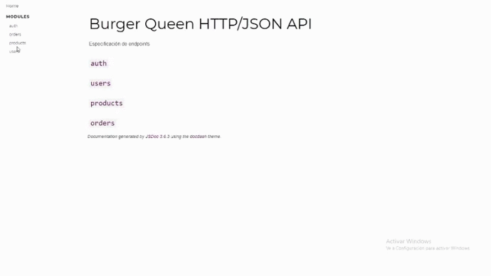
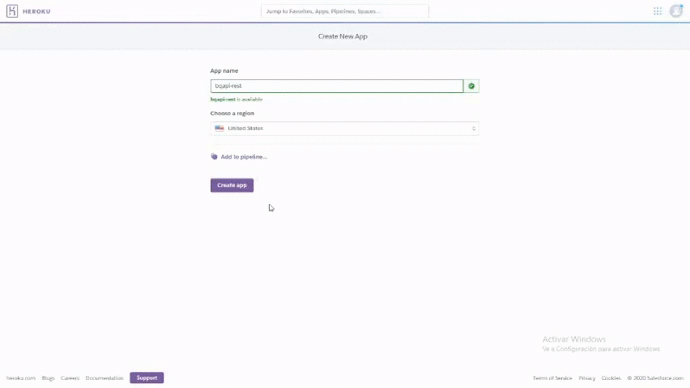

# Burger Queen API

El restaurante Burger Queen nos ha solicitado por encargo un sistema a través del cual puedan tomar pedidos a los clientes usando una *tablet*, y enviarlos a la cocina en orden para que se preparen eficientemente.

Este proyecto aborda el área del servidor para integrarlo con la interfaz en la que posteriormente estaré trabajando.

## Proceso de desarrollo

Iniciamos interpretando muy bien la documentación que fue puesta a nuestra disposición para tener claro la organización y el estándar de código que se iba a manejar.



Luego comenzamos a trabajar la conexión con la BBDD MongoDB Atlas, para esto creamos un módulo en el que plasmamos toda la lógica de la conexión llamando a los métodos de mongodb, una vez terminado esto nos enfocamos en trabajar las peticiones de las diferentes rutas: *auth, users, products, orders*.
Para trabajar estas peticiones dividimos el código en diferentes módulos de acuerdo a las rutas dentro de la carpeta controlador, en cada módulo se crearon métodos siguiendo el estándar del framework express, empleando código asíncrono y accediendo a los objetos request, response y al middleware next para manejar la capa de errores o códigos de respuesta HTTP.
Otro aspecto en el que trabajamos fue en la autenticación de usuarios, tanto para distinguir aquellos que tengan el rol de administrador como para validar que estén correctamente autenticados y saber quienes son, para esto trabajamos con JWT este estándar de código abierto basado en JSON que nos permite crear un token que sirva para enviar los datos del usuario y garantizar que sean válidos y seguros, además se le programó un tiempo de caducidad de 12h para más seguridad.


Por otro lado, en el proyecto existen acciones que son exclusivas para el administrador, para manejar esto y los errores solicitados en la documentación empleamos uno de los beneficios que nos proporciona Express que son los middlewares. En este caso trabajamos en dos middlewares ```requireAuth``` para aquellas acciones que están disponibles para todos los usuarios que tengan credenciales en la plataforma y ```requireAdmin``` para las acciones exclusivas del administrador tales como crear un nuevo usuario o producto, actualizarlos y revisar el historial de ordenes.
Y para la capa de errores en caso de que el usuario no tenga credenciales o su token ya caducó se le mostrará ```401: 'Unauthorized'```, otro ejemplo sería en caso de intentar acceder a una ruta que no existe se le mostrará ```404: 'Not found'```.
Nos apegamos muy bien a lo que el cliente solicitó y la documentación que nos entregó por lo tanto al momento de correr los tests e2e logramos una cobertura del 100%.
Una vez terminada la API, nos enfocamos en el tema del despliegue, y por su versatilidad y rapidez decidimos trabajarlo en la plataforma Heroku, entregándole al cliente la URL del proyecto para que pueda ser integrado con el FrontEnd y puesto en marcha para su uso en el restaurante.



### Herramientas y tecnologías utilizadas

### Node.js

La herramienta principal que se utilizó para desarrollar el API RESTful fue **Node.js**, entorno que permite a los desarrolladores crear toda clase de herramientas de lado servidor y aplicaciones en JavaScript.

### Express
Se empleó **Express** como framework, que se caracteriza principalmente por ser minimalista y liviano y una de las herramientas más poderosas que posee son los middlewares, algo que se utilizó bastante en el proyecto.

### MongoDB Atlas

Para la persistencia de datos se utilizó **MongoDB Atlas** y se creó la conexión con el cliente siguiendo el patrón de diseño singleton que permite crear una instancia única de conexión con la BBDD, de manera que al momento de llamar a los métodos de la librería mongodb no se sature con múltiples conexiones y se genere algún.

- REST
- JWT
- Postman
- Heroku